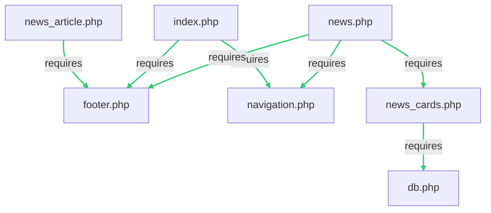

# Deploy

* Execute task 'Push to Mayar' (or deploy-mayar.sh directly)
* Enter username + password for ssh access
* contents of www folder are copied to public_html

# Live configuration
The database credentials are stored in /config/app.ini. This folder and file have to be created on the mayar webserver one directory above the public_html directory. This ensures that the file is not publicly available and the credentials stay secret.

# Database
The file /config/db.sql contains the database schema, which could be deployed using phpmyadmin

# File hierachy
